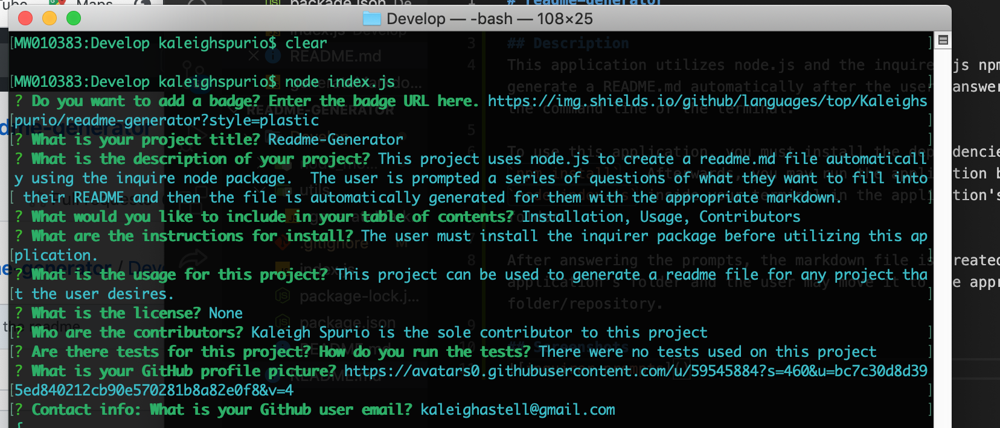
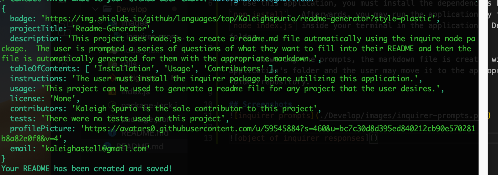
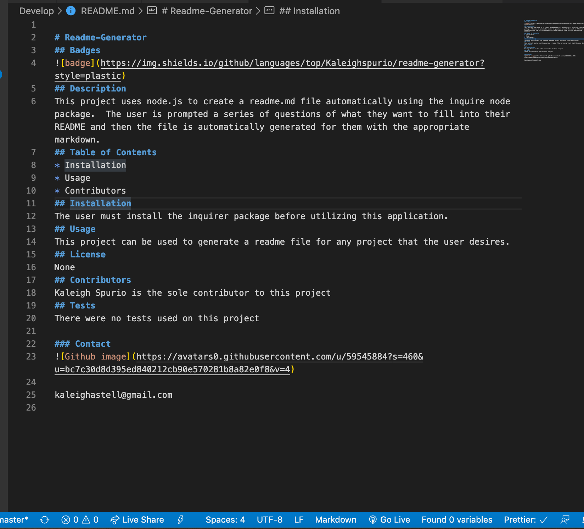

# readme-generator

## Description
This application utilizes node.js and the inquirer.js npm package to generate a README.md automatically after the users answers prompts on the command line of the terminal.  

To use this application, you must install the dependencies by running `npm install`.  Afterwards, you may run the application by typing `node index.js` inside your terminal in the application's Develop folder.

After answering the prompts, the markdown file is created within the application's folder and the user may move it to the appropriate folder/repository.

## Screenshots

